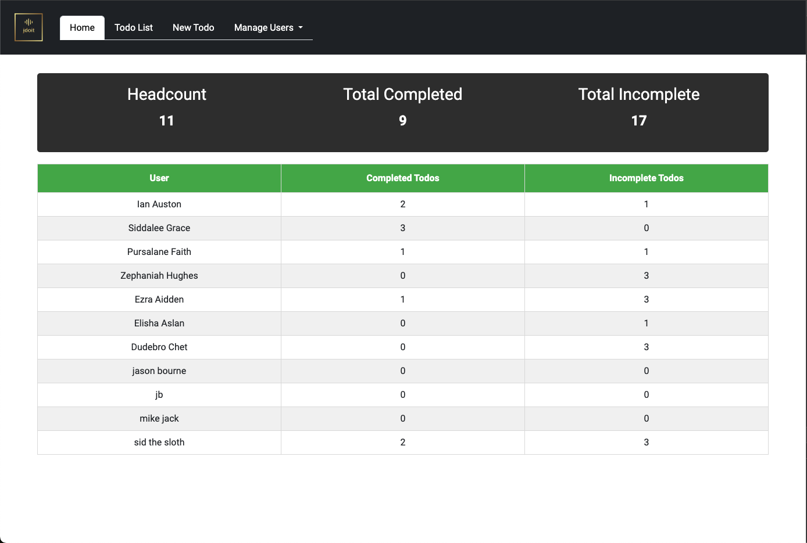
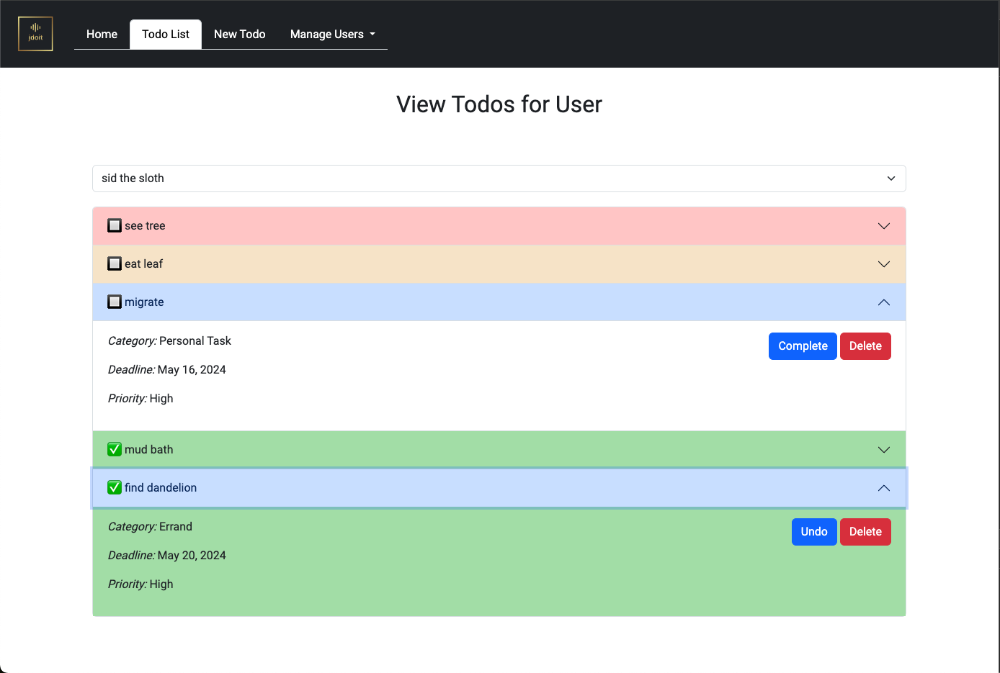
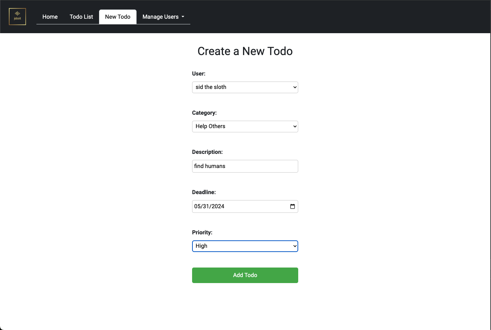
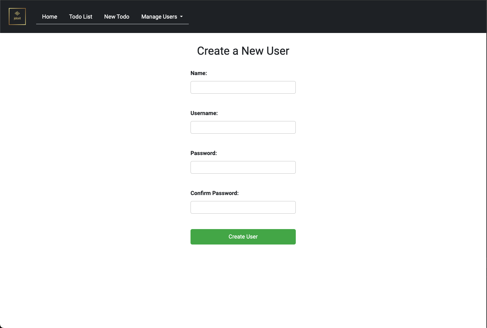
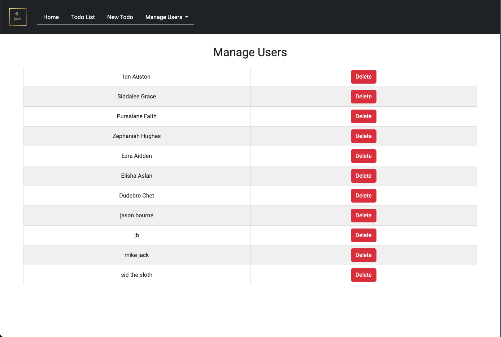

# Stay Organized

Stay Organized is a simple yet powerful task management application. It allows users to create, view, and manage their to-do items, helping them stay organized and productive.

## Pages Overview

- [index.html](public/index.html): This is the home page of the application. It provides navigation to other pages.


- [todos.html](public/todos.html): This page displays the list of all to-do items. Users can view their tasks and their status here.


- [new_todo.html](public/new_todo.html): This page allows users to create a new to-do item. Users can enter the task details and save them for future reference.


- [new_user.html](public/new_user.html): This page allows new users to register in the application. It collects necessary user information and saves it.


- [delete_user.html](public/delete_user.html): This page allows for the deletion of a user account. It requires user confirmation before proceeding with the deletion.


## Technologies
[](https://developer.mozilla.org/en-US/docs/Web/HTML)
[](https://developer.mozilla.org/en-US/docs/Web/JavaScript)
[](https://developer.mozilla.org/en-US/docs/Web/CSS)
[](https://getbootstrap.com/)

## Project Setup

To set up this server locally, you need to have Node.js installed on your machine. After cloning the repository, run `npm install` to install the necessary dependencies. Then, you can start the server by running `npm start`.

- Install the projects dependencies with NPM (Node Package Manager).
  
  ```bash
    npm install
  ```

- Start the local server

  **Command to start the server**
  ```bash
    npm start
  ```

  **Expected Output**
  ```bash
    App listening at port 8083
  ```

## License

[](https://opensource.org/licenses/MIT)


